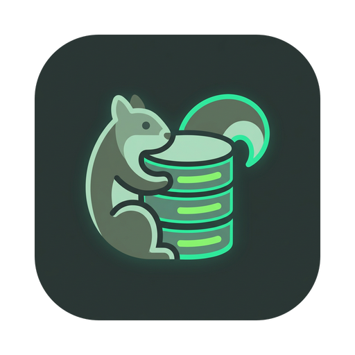

<div align="center">
  

  <h1>DataSQuirreL</h1>

  <p>
    <strong>A blazing fast, lightweight, and modern database viewer built for power users.</strong>
  </p>

  <p>
    <a href="https://github.com/ayanrocks/DataSQuirreL/graphs/contributors">
      
    </a>
    <a href="https://github.com/ayanrocks/DataSQuirreL/network/members">
      
    </a>
    <a href="https://github.com/ayanrocks/DataSQuirreL/stargazers">
      
    </a>
    <a href="https://github.com/ayanrocks/DataSQuirreL/issues">
      
    </a>
    <a href="https://github.com/ayanrocks/DataSQuirreL/blob/master/LICENSE">
      
    </a>
  </p>
</div>

<hr />

## 🐿️ About The Project

**DataSQuirreL** is built from the ground up to provide a fast, intuitive, and visually stunning experience for interacting with your databases. Whether you're making quick edits, running complex queries, or just exploring your schema, DataSQuirreL gives you the tools you need in an interface you'll love.

Engineered with the incredibly fast **Tauri** framework and highly reactive **Svelte 5**, we keep performance high and memory footprint astonishingly low. It looks like a modern web application but runs with native speed.

### 🚀 Built With

- [![Tauri][Tauri-badge]][Tauri-url]
- [![Svelte][Svelte-badge]][Svelte-url]
- [![TypeScript][TypeScript-badge]][TypeScript-url]
- [![Vite][Vite-badge]][Vite-url]
- [![TailwindCSS][TailwindCSS-badge]][TailwindCSS-url]

---

## ✨ Features

- **Blazing Fast**: Engineered with Rust and Tauri for near-native performance and incredibly low overhead.
- **Modern Interface**: A clean, sleek, and highly polished UI using Tailwind CSS with beautiful typography and subtle animations.
- **Cross-Database Support**: Connect seamlessly to **PostgreSQL**, **MySQL**, and **MSSQL** right out of the box.
- **Full Data Editing (CRUD)**: Directly view, insert, update, and delete table records with a familiar spreadsheet-like experience.
- **Advanced Query Editor**: Write and execute raw SQL queries effortlessly with intelligent fuzzy suggestions and typo correction.
- **Intelligent Workspace**: Dynamically handle your workspace with auto-naming tabs, quick search capabilities, and customizable layouts.
- **Keyboard Friendly**: Edit cells quickly, manage undo/redo history, and navigate using your keyboard to keep you in the flow.

---

## 🛠️ Getting Started

### Prerequisites

You will need `Node.js`, `npm` (or your preferred package manager), and the Rust toolchain installed on your machine.
For setting up Tauri prerequisites for your specific OS, please refer to the [Tauri setup guide](https://tauri.app/v1/guides/getting-started/prerequisites).

### Installation

1. **Clone the repository**

   ```bash
   git clone https://github.com/ayanrocks/DataSQuirreL.git
   cd DataSQuirreL
   ```

2. **Install frontend dependencies**

   ```bash
   npm install
   ```

3. **Install the Tauri CLI (if not already globally installed)**

   ```bash
   cargo install tauri-cli
   ```

4. **Run in development mode**

   ```bash
   npm run tauri dev
   ```

5. **Build for production**
   ```bash
   npm run build
   npm run tauri build
   ```

---

## 🗺️ Roadmap

### Current Iteration (v0.1.x -> v1.0.x)

- [x] Basic Table Viewer & Explorer
- [x] Write and Execute Custom Queries
- [x] Direct inline CRUD operations on Tables
- [x] Excel-like cell editing & navigation
- [x] PostgreSQL, MySQL, MSSQL Support

### Upcoming: v1.1.X

- [ ] Comprehensive query history and logging
- [ ] Concurrent connections to multiple remote databases

### Planned: v2.0.X

- [ ] Rich theming support (Material UI, Ayu, Dracula, Noctis, Solarized algorithms)
- [ ] Plugins system for deeper extensibility

---

## 🤝 Contributing

We welcome contributions from the community! DataSQuirreL is an open-source project and we'd love for you to get involved.

Please read our [Contributing Guide](CONTRIBUTING.md) for details on our code of conduct, and the process for submitting pull requests.

1. Fork the Project
2. Create your Feature Branch (`git checkout -b feat/AmazingFeature`)
3. Commit your Changes using Conventional Commits (`git commit -m 'feat: add some AmazingFeature'`)
4. Push to the Branch (`git push origin feat/AmazingFeature`)
5. Open a Pull Request

---

## 📜 License

Distributed under the MIT License. See `LICENSE` for more information.

---

## 💬 Contact

Ayan Banerjee - [ayanrocks](https://github.com/ayanrocks)

Project Link: [https://github.com/ayanrocks/DataSQuirreL](https://github.com/ayanrocks/DataSQuirreL)

<!-- Markdown link references -->

[Tauri-badge]: https://img.shields.io/badge/tauri-%2324C8DB.svg?style=for-the-badge&logo=tauri&logoColor=white
[Tauri-url]: https://tauri.app/
[Svelte-badge]: https://img.shields.io/badge/svelte-%23f1413d.svg?style=for-the-badge&logo=svelte&logoColor=white
[Svelte-url]: https://svelte.dev/
[TypeScript-badge]: https://img.shields.io/badge/typescript-%23007ACC.svg?style=for-the-badge&logo=typescript&logoColor=white
[TypeScript-url]: https://www.typescriptlang.org/
[TailwindCSS-badge]: https://img.shields.io/badge/tailwindcss-%2338B2AC.svg?style=for-the-badge&logo=tailwind-css&logoColor=white
[TailwindCSS-url]: https://tailwindcss.com/
[Vite-badge]: https://img.shields.io/badge/vite-%23646CFF.svg?style=for-the-badge&logo=vite&logoColor=white
[Vite-url]: https://vitejs.dev/
